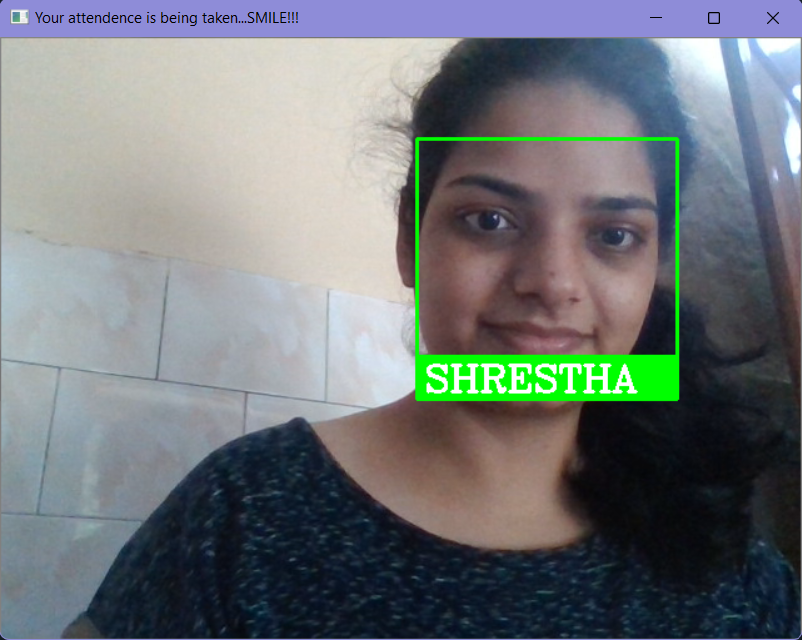

# Attendance_Tracker
 ### About 
  This program is all about taking attendace using face recognition.
  
  The model is trained with some images. When the person stands in front of webcam then his/her face will be recognized using trained images and his/her attendace will be updated in the excel sheet with name and time.

# Steps to run the application
 1.install the apk from the link below  
          https://drive.google.com/file/d/1OGYhpiVzYAOJPH85L9QFIznbgDKSo6us/view?usp=drivesdk
  
 
 2.Sign in with google or sign up, verify your email and sign in again
 
 # Screenshots of the Application:-
 
 ### Starting Page 
  
 
 ### Signin Page 
  

 ### Signup Page 
  
 
 ### User Verification Mail 
  
 
