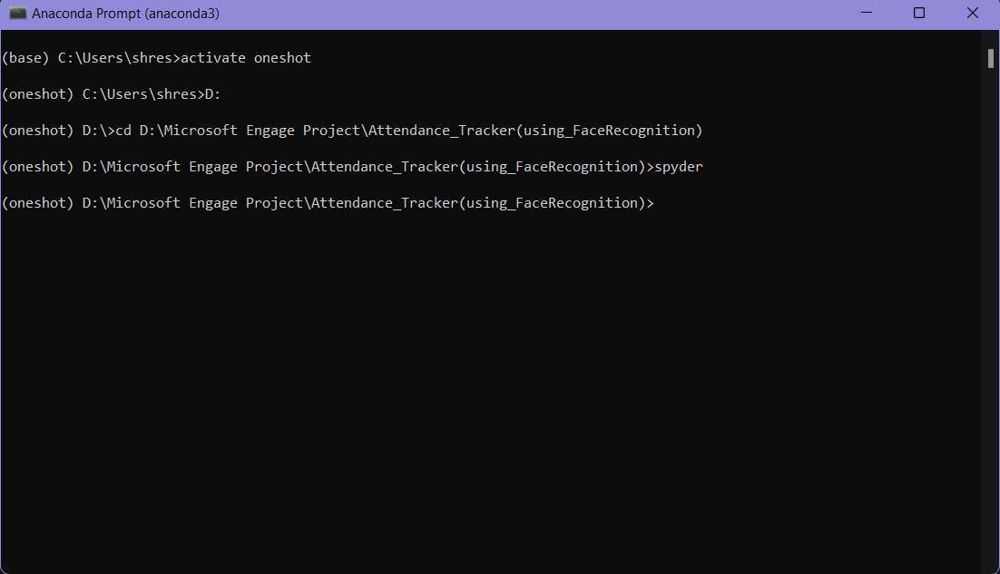
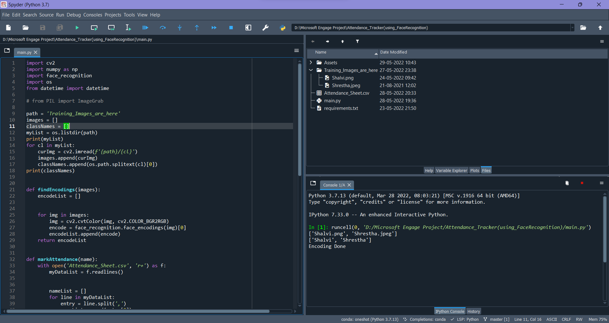
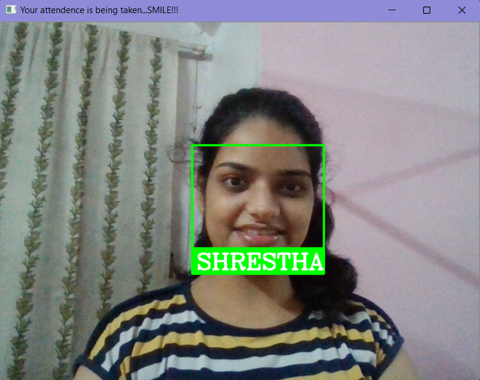
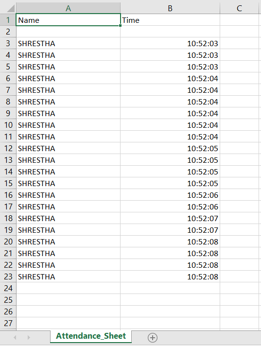

# Attendance_Tracker
 ### About 
  This project is all about taking attendance using face recognition.
  
  The model is trained with some images. When the person stands in front of webcam then his/her face will be recognized using trained images and his/her attendance will be updated in the excel sheet with name and time.

# Pre-requisites
Install Visual Studio with Desktop development with C++ (to compile C++ toolkit ,i.e., Dlib) 

# Steps to run the program :
 1. Clone all the files to your computer.
 2. Go to your Aaconda Prompt and set up the environment: " create -n oneshot python=3.7 ".
 
    (I have kept my environment name as "oneshot", you can keep it as your wish.)
 3. Then go to that path where you have kept the files in your system: " cd D:\Microsoft Engage Project\Attendance_Tracker(using_FaceRecognition) ".
 4. Install all the required libraries: " pip install -r requirements.txt ".
 5. Install spyder: " pip install spyder ".
 6. Run the code in spyder (Shift+Enter). Your face will get recognized by the trained images and gets updated to the excel sheet.
 7. Check the excel sheet for attendance.
 
 # Screenshots:-
 
 ### Anaconda Prompt 
  
 
 ### Spyder 
  

 ### Webcam 
  
 
 ### Attendance Sheet 
  
 
